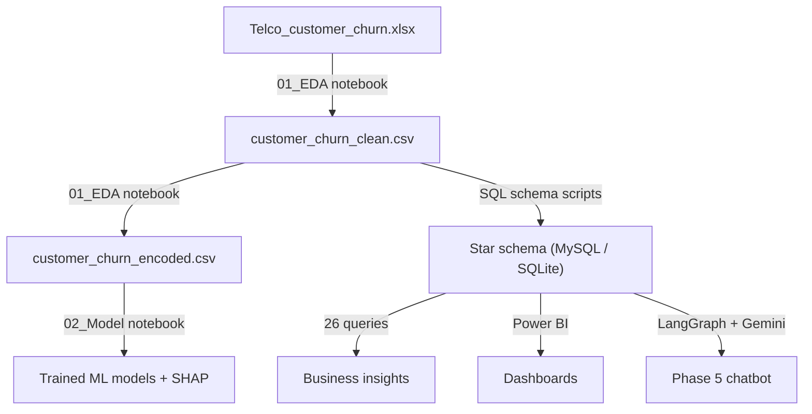

# Project Structure

A complete, annotated map of the repository. Each phase of the project lives in
its own top-level folder.

```
Project 1/
│
├── Analysis and Models/                  # Phase 1-2: Data science notebooks
│   ├── 01_EDA_and_Preprocessing.ipynb    #   Load, clean, feature-engineer, EDA -> clean/encoded CSVs
│   └── 02_Model_Building_and_Evaluation.ipynb  # Train/evaluate 4 models, tune CatBoost, SHAP
│
├── Data Files/                           # All datasets
│   ├── Telco_customer_churn.xlsx         #   Raw source data (7,043 customers, 33 cols)
│   ├── customer_churn_clean.csv          #   Cleaned + engineered features (chatbot/BI source)
│   └── customer_churn_encoded.csv        #   ML-ready, encoded features
│
├── Database and analysis/                # Phase 3: SQL analytics layer
│   ├── 01_database_schema_setup.sql      #   MySQL star schema (DDL + population)
│   ├── 02_churn_analysis_queries.sql     #   26 analytical queries (MySQL)
│   ├── 03_sqlite_schema_setup.sql        #   SQLite port of the star schema
│   ├── 03_sqlite_churn_queries.sql       #   SQLite port of the 26 queries
│   ├── sql_script.md                     #   Queries with documented result tables
│   ├── erd.png                           #   Entity-relationship diagram
│   └── erd diagram (1).png               #   ERD (alternate export)
│
├── PowerBI/                              # Phase 4: Business intelligence
│   ├── Final Report.pbix                 #   4-page interactive Power BI report
│   └── Images/
│       ├── Dashboard/                    #   Dashboard screenshots (used in README)
│       │   ├── 1. Executive Summary.png
│       │   ├── 2. Churn Analysis.png
│       │   ├── 3. Revenue Insights.png
│       │   └── 4. Customer Behaviour.png
│       └── Layout/                       #   Icons & background assets for the report
│
├── phase5_chatbot/                       # Phase 5: GenAI chatbot
│   ├── app.py                            #   Streamlit chat UI (sample chips + free text)
│   ├── config.py                         #   Paths, model settings, lazy Gemini factory
│   ├── state.py                          #   LangGraph TypedDict state
│   ├── nodes.py                          #   query_generator / query_executor / response_formatter
│   ├── graph.py                          #   LangGraph wiring + conditional retry edges
│   ├── README.md                         #   Chatbot-specific setup & docs
│   ├── .env.example                      #   Template for GOOGLE_API_KEY (copy to .env)
│   ├── ui/
│   │   └── sample_questions.py           #   Curated Q1-Q26 sample questions by category
│   ├── prompts/
│   │   ├── schema_context.py             #   Schema + business rules for the LLM prompt
│   │   └── query_examples.py             #   Question -> SQL few-shot examples
│   └── database/
│       ├── connection.py                 #   Read-only query runner + connection helpers
│       ├── init_db.py                    #   Builds churn.db from the cleaned CSV
│       ├── sqlite_schema.sql             #   Star-schema build script (runtime)
│       └── churn.db                      #   Generated SQLite DB (gitignored)
│
├── requirements.txt                      # Python dependencies for the project
├── README.md                             # Main project overview
├── PROJECT_STRUCTURE.md                  # This file
└── .gitignore                            # Excludes secrets, generated DB, caches
```

## Data Flow



## Conventions

- **Phases are self-contained folders.** Each can be read top-to-bottom.
- **`customer_churn_clean.csv` is the canonical dataset** for SQL, Power BI, and
  the chatbot. The encoded CSV is only for ML.
- **Generated and secret files are gitignored:** `phase5_chatbot/.env`,
  `phase5_chatbot/database/churn.db`, `catboost_info/`, and `__pycache__/`.
