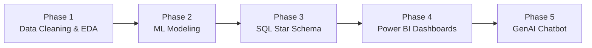
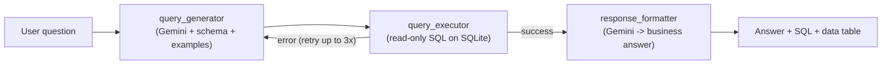

# Customer Churn Analysis & GenAI Chatbot

End-to-end customer churn analytics for a Telco provider (**7,043 customers**) —
from raw data cleaning and machine-learning modeling, through a SQL star schema
and Power BI dashboards, to a **GenAI chatbot** that answers business questions
in plain English.


---

## Table of Contents

- [Business Problem](#business-problem)
- [Project Phases](#project-phases)
- [Tech Stack](#tech-stack)
- [Power BI Dashboards](#power-bi-dashboards)
- [Key Findings](#key-findings)
- [Machine Learning Results](#machine-learning-results)
- [Business Recommendations](#business-recommendations)
- [Phase 5: GenAI Churn Chatbot](#phase-5-genai-churn-chatbot)
- [Getting Started](#getting-started)
- [Repository Structure](#repository-structure)
- [Author](#author)

---

## Business Problem

Customer churn — when subscribers cancel their service — directly erodes
recurring revenue. For this Telco provider, **26.54%** of customers have already
churned, representing **~$139,131 in lost monthly recurring revenue**.

This project answers three questions:

1. **Who** is churning, and **why**? (EDA + SQL analytics)
2. **Can we predict** churn before it happens? (machine learning)
3. **How do we let non-technical stakeholders explore the data** without writing
   SQL? (GenAI chatbot)

---

## Project Phases



| Phase | Deliverable | Location |
|-------|-------------|----------|
| 1. Data Cleaning & EDA | Cleaning, feature engineering, exploratory analysis | [`Analysis and Models/01_EDA_and_Preprocessing.ipynb`](Analysis%20and%20Models/01_EDA_and_Preprocessing.ipynb) |
| 2. ML Modeling | 4 classifiers + tuning + SHAP explainability | [`Analysis and Models/02_Model_Building_and_Evaluation.ipynb`](Analysis%20and%20Models/02_Model_Building_and_Evaluation.ipynb) |
| 3. SQL Analytics | MySQL star schema + 26 analytical queries | [`Database and analysis/`](Database%20and%20analysis) |
| 4. BI Dashboards | 4-page interactive Power BI report | [`PowerBI/`](PowerBI) |
| 5. GenAI Chatbot | NL-to-SQL chatbot (LangGraph + Gemini + Streamlit) | [`phase5_chatbot/`](phase5_chatbot) |

---

## Tech Stack

- **Data & ML:** Python, pandas, NumPy, scikit-learn, imbalanced-learn (SMOTE),
  XGBoost, CatBoost, SHAP, Matplotlib, Seaborn
- **Database:** MySQL (Phase 3 star schema), SQLite (chatbot runtime)
- **BI:** Power BI
- **GenAI:** Google Gemini (`gemini-2.5-flash`), LangGraph, LangChain, Streamlit

---

## Power BI Dashboards

A 4-page interactive report (`PowerBI/Final Report.pbix`) summarizing churn,
revenue, and customer behaviour.

### 1. Executive Summary


### 2. Churn Analysis


### 3. Revenue Insights


### 4. Customer Behaviour


---

## Key Findings

Derived from the EDA notebook and the 26 SQL queries
([`Database and analysis/sql_script.md`](Database%20and%20analysis/sql_script.md)).

### Contract & billing are the strongest churn drivers
| Segment | Churn rate |
|---------|-----------:|
| Month-to-month contract | **42.71%** |
| One year contract | 11.27% |
| Two year contract | 2.83% |
| Electronic check payment | **45.29%** |
| Auto-pay (credit card) | 15.24% |
| Paperless billing = Yes | 33.57% |

### Early tenure is the danger zone
| Tenure group | Churn rate |
|--------------|-----------:|
| 0–1 Year | **47.44%** |
| 1–2 Years | 28.71% |
| 2–4 Years | 20.39% |
| 4+ Years | 9.51% |

Roughly **61% of all churn happens within the first month** of the lifecycle.

### Services & support reduce churn
- **Fiber optic** customers churn at **41.89%** vs **18.96%** for DSL.
- No **online security**: 41.77% churn vs 14.61% with it.
- No **tech support** (internet customers): 41.64% churn vs 15.17% with it.
- Customers using **1 service** churn far more than those using **8–9 services**
  (5.29% at 9 services).

### Revenue impact
- Churned customers have a **higher ARPU ($74.44)** than retained ($61.27) —
  we are losing our higher-paying customers.
- **~$139,131** monthly recurring revenue is lost to churn.
- **Los Angeles, San Diego, and San Francisco** lose the most lifetime value.

---

## Machine Learning Results

- **Target:** `churn_value` (1 = churned, 0 = retained)
- **Pipeline:** 80/20 stratified split → **SMOTE** (train only) → `StandardScaler`
- **Features:** 35 (IDs and leakage columns removed)

| Model | ROC-AUC | Accuracy | Recall (churn) | F1 (churn) |
|-------|--------:|---------:|---------------:|-----------:|
| **Logistic Regression** | **0.8461** | 0.79 | **0.66** | **0.62** |
| CatBoost | 0.8437 | 0.78 | 0.62 | 0.60 |
| Random Forest | 0.8381 | 0.79 | 0.61 | 0.60 |
| CatBoost (tuned) | 0.8374 | 0.78 | 0.60 | 0.59 |
| XGBoost | 0.8289 | 0.77 | 0.59 | 0.58 |

**Logistic Regression** was the best performer (highest ROC-AUC **and** the best
recall on churners — the business-critical metric for retention). Model
behaviour was explained with **SHAP**, confirming contract type, tenure, and
internet/security services as the dominant churn drivers — consistent with the
SQL findings.

---

## Business Recommendations

1. **Convert month-to-month customers to annual contracts.** Month-to-month
   churn (42.71%) is ~15x the two-year rate (2.83%). Offer loyalty discounts or
   bundle incentives for committing to longer terms.
2. **Win the first 90 days.** With ~61% of churn in month one, invest in
   onboarding, welcome offers, and proactive check-ins for new customers.
3. **Migrate customers off electronic check.** It carries a 45.29% churn rate;
   nudge customers toward auto-pay (credit card / bank transfer ~15%).
4. **Bundle security and tech support**, especially for **fiber optic** users —
   adding these services cuts churn by more than half.
5. **Prioritize high-value, high-risk customers.** Use the model's churn
   probability + the SQL "top 50 at-risk" list to target retention spend where
   lifetime value is greatest (LA, San Diego, San Francisco).
6. **Operationalize the model** by scoring active customers monthly and feeding
   the highest-risk, highest-ARPU accounts to the retention team.

---

## Phase 5: GenAI Churn Chatbot

A natural-language chatbot that turns business questions into SQL, runs them on a
SQLite copy of the star schema, and replies in plain English — with a
**self-correcting retry loop** if a query fails.



**Highlights**
- `gemini-2.5-flash` via `langchain-google-genai`
- LangGraph state machine with a 3-retry self-correction loop
- Interactive Streamlit UI: click sample questions **or** type your own
- Transparency panels showing the generated SQL and the raw result table

See [`phase5_chatbot/README.md`](phase5_chatbot/README.md) for full details.

```bash
# from the project root, after setup (below)
streamlit run phase5_chatbot/app.py
```

---

## Getting Started

### 1. Clone and install

```bash
git clone <your-repo-url>
cd "Project 1"
pip install -r requirements.txt
```

### 2. Reproduce the analysis (optional)

Open the notebooks in order:

1. [`Analysis and Models/01_EDA_and_Preprocessing.ipynb`](Analysis%20and%20Models/01_EDA_and_Preprocessing.ipynb)
2. [`Analysis and Models/02_Model_Building_and_Evaluation.ipynb`](Analysis%20and%20Models/02_Model_Building_and_Evaluation.ipynb)

### 3. Run the chatbot (Phase 5)

```bash
# add your Gemini API key
cp phase5_chatbot/.env.example phase5_chatbot/.env
# edit phase5_chatbot/.env and set GOOGLE_API_KEY=...  (https://aistudio.google.com/app/apikey)

streamlit run phase5_chatbot/app.py
```

The SQLite database is built automatically from
[`Data Files/customer_churn_clean.csv`](Data%20Files/customer_churn_clean.csv) on
first run.

> **Note:** Your API key lives in `phase5_chatbot/.env`, which is gitignored and
> never committed.

---

## Repository Structure

A high-level view (see [`PROJECT_STRUCTURE.md`](PROJECT_STRUCTURE.md) for the
full annotated tree):

```
Project 1/
├── Analysis and Models/      # Phase 1-2: EDA, preprocessing, ML notebooks
├── Data Files/               # Raw Excel + cleaned/encoded CSVs
├── Database and analysis/    # Phase 3: SQL schema, 26 queries, ERD
├── PowerBI/                  # Phase 4: .pbix report + dashboard images
├── phase5_chatbot/           # Phase 5: GenAI chatbot (LangGraph + Gemini)
├── requirements.txt          # Python dependencies
└── README.md                 # You are here
```

---

## Author

Built as a multi-phase data analytics and GenAI bootcamp project covering the
full lifecycle: data engineering, machine learning, business intelligence, and
applied generative AI.
